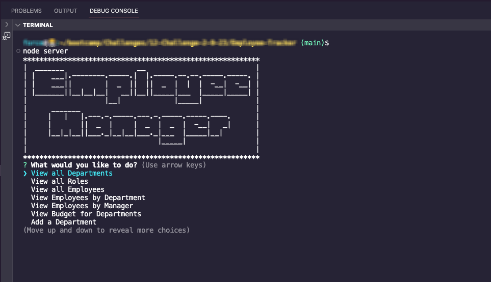

# Employee-Tracker
SQL

## Description
A Node.js command-line application that takes in information about employees and manipulates a database to store and retrieve data.

## Screenshot

## Table of Contents
1. [Installation](#installation)
2. [Usage](#usage)
3. [Walkthrough](#walkthrough)
4. [Tests](#tests)
5. [License](#license)

## Installation
The user would clone the repository from GitHub and download Node. The application requires inquirer, MySQL2, console-table-printer and dotenv modules to function.

## Usage
Using your command line, choose the activity you would like to complete and you will recieve further prompts to complete your activity. Command line will advise when successful and show the updated database table.

## Walkthrough
[Video Walkthrough Link](https://drive.google.com/file/d/1_a8lYgEO4t9n3sNg0-GbOP3xlQCksdED/view?usp=sharing)

## Tests
N/A

## License

Licensed under the MIT license.

Copyright © YankeeKnight. All rights reserved.
